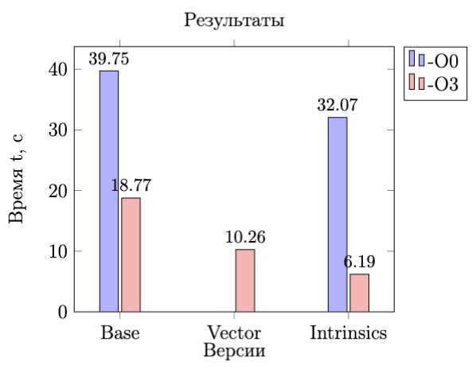

# Исследование зависимости времени выполнения программы от уровня оптимизации

## Цель работы

1. Построение модели множества Мандельброта с различными способами вычисления.
2. Измерение времени выполнения программы для каждого способа и анализ зависимости времени от уровня оптимизации.

**Используемые инструменты:**

- Графическая библиотека SFML 2.6.1
- Библиотека `time`
- Библиотека `immintrin`

---

## Теоретическая часть

### Множество Мандельброта

Множество Мандельброта — фрактал на комплексной плоскости, задаваемый итерационной формулой: $z_{n+1} = z_n^2 + c$, где $z_0 = 0$, а $c$ — комплексная константа.
Точка $c$ принадлежит множеству, если последовательность $z_n$ не стремится к бесконечности. На практике итерации выполняются до $n_{\text{max}}$ (например, 1000), и если $|z_n| < 2$, точка считается принадлежащей множеству.

### Intrinsics функции

Intrinsics — низкоуровневые функции для оптимизации кода с использованием SIMD-инструкций (AVX, SSE), позволяющие выполнять операции над несколькими данными одновременно.

---

## Методика измерений

1.  **Характеристики аппаратуры**

    - Операционная система: Linux 6.11.0-21-generic (x86_64)
    - Процессор: 12th Gen Intel(R) Core(TM) i5-12600KF; 10 cores; 16 treads

1.  **Приборная погрешность**
    

    	
Приборную погрешность измерим с помощью тестовой программы:

        #include <stdio.h>
        #include <time.h>

        int main(int argc, char* argv[]) {
        	printf("PROGRAM TIME: %lg sec\n", (double)clock() / CLOCKS_PER_SEC);
        	return 0;
        }

    

    |  №   |   1    |   2    |   3    |   4    |   5    |   6    |   7    |   8    |   9    |   10   |
    | :--: | :----: | :----: | :----: | :----: | :----: | :----: | :----: | :----: | :----: | :----: |
    | t, c | 0,0061 | 0,0072 | 0,0080 | 0,0076 | 0,0059 | 0,0036 | 0,0064 | 0,0035 | 0,0049 | 0,0033 |

    **Статистика**

    - Среднее время: `0,0057 ± 0,0001` с (`1,8` %)

> [!TIP]
> Для проверки корректности работы соответствующих оптимизаций будем сравнивать результаты вычислений множества Мандельброта с помощью графической библиотеки. Будем следить за изменениями полученного изображения, чтобы исправить оптимизации, нарушившие ход выполнения программы.

> [!IMPORTANT]
> Все последующие измерения времени будем проводить без использовани графической библиотеки, рассчитывая каждую из точек по 300 раз для увеличения среднего времени выполнения программы.

---

## Базовая версия

1. **С оптимизацией `-O3`:**
   | № | 1 | 2 | 3 | 4 | 5 | 6 | 7 | 8 | 9 | 10 |
   | :--: | :---: | :---: | :---: | :---: | :---: | :---: | :---: | :---: | :---: | :---: |
   | t, c | 18,80 | 18,74 | 18,80 | 18,80 | 18,72 | 18,81 | 18,75 | 18,80 | 18,82 | 18,73 |

   **Статистика**

   - Среднее время: `18,77 ± 0,33` с (`1,8` %)
   - FPS: `16,86 ± 0,16` (`0,96` %)

<figure style="text-align: center;">
    
    <figcaption>Мандельброт v1.1</figcaption>
</figure>

2. **Без оптимизации:**
   | № | 1 | 2 | 3 | 4 | 5 | 6 | 7 | 8 | 9 | 10 |
   | :--: | :---: | :---: | :---: | :---: | :---: | :---: | :---: | :---: | :---: | :---: |
   | t, c | 39,79 | 39,78 | 39,88 | 39,74 | 40,02 | 39,87 | 39,58 | 39,58 | 39,59 | 39,64 |

   **Статистика**

   - Среднее время: `39,75 ± 0,71` с (`1,8` %)
   - FPS: `8,46 ± 0,02` (`0,27` %)

---

## Версия на массивах

1. **С оптимизацией `-O3`:**
   | № | 1 | 2 | 3 | 4 | 5 | 6 | 7 | 8 | 9 | 10 |
   | :--: | :---: | :---: | :---: | :---: | :---: | :---: | :---: | :---: | :---: | :---: |
   | t, c | 10,04 | 10,48 | 10,14 | 10,49 | 10,15 | 10,53 | 10,05 | 10,05 | 10,51 | 10,14 |

   **Статистика**

   - Среднее время: `10,26 ± 0,22` с (`2,2` %)
   - FPS: `29,12 ± 0,94` (`3,2` %)

2. **Без оптимизации:**
   | № | 1 | 2 | 3 | 4 | 5 |
   | :--: | :---: | :---: | :---: | :---: | :---: |
   | t, c | 255,34 | 255,16 | 255,00 | 255,83 | 255,65 |

   **Статистика**

   - Среднее время: `254,99 ± 4,52` с (`1,8` %)
   - FPS: `1,77 ± 0,01` (`0,56` %)

---

## Intrinsics версия

1. **С оптимизацией `-O3`:**
   | № | 1 | 2 | 3 | 4 | 5 | 6 | 7 | 8 | 9 | 10 |
   | :--: | :---: | :---: | :---: | :---: | :---: | :---: | :---: | :---: | :---: | :---: |
   | t, c | 6,23 | 6,15 | 6,18 | 6,18 | 6,23 | 6,17 | 6,20 | 6,19 | 6,19 | 6,18 |

   **Статистика**

   - Среднее время: `6,19 ± 0,11` с (`1,8` %)
   - FPS: `47,35 ± 4,23` (`8,9` %)

<figure style="text-align: center;">
    
    <figcaption>Мандельброт v3.1</figcaption>
</figure>

2. **Без оптимизации:**
   | № | 1 | 2 | 3 | 4 | 5 | 6 | 7 | 8 | 9 | 10 |
   | :--: | :---: | :---: | :---: | :---: | :---: | :---: | :---: | :---: | :---: | :---: |
   | t, c | 32,12 | 31,83 | 32,17 | 32,22 | 32,16 | 32,16 | 31,94 | 32,18 | 32,11 | 31,88 |

   **Статистика**

   - Среднее время: `32,08 ± 0,57` с (`1,8` %)
   - FPS: `10,17 ± 0,01` (`0,1` %)

---

## Анализ результатов

> [!NOTE]
> Наибольшее ускорение достигнуто при использовании Intrinsics: время выполнения сократилось в ~3 раза по сравнению с базовой версией.

> [!NOTE]
> Версия на массивах без оптимизации оказалась наименее эффективной.

<figure style="text-align: center;">
    
</figure>

---

## Вывод

В ходе работы была реализована модель множества Мандельброта с применением различных оптимизаций. Наилучший результат показала Intrinsics версия с оптимизацией `-O3`, что подтверждает эффективность использования SIMD-инструкций для ускорения вычислений. Итоговый прирост производительности составил примерно 3 раза, что соответствует ожиданиям для однопоточных оптимизаций.
